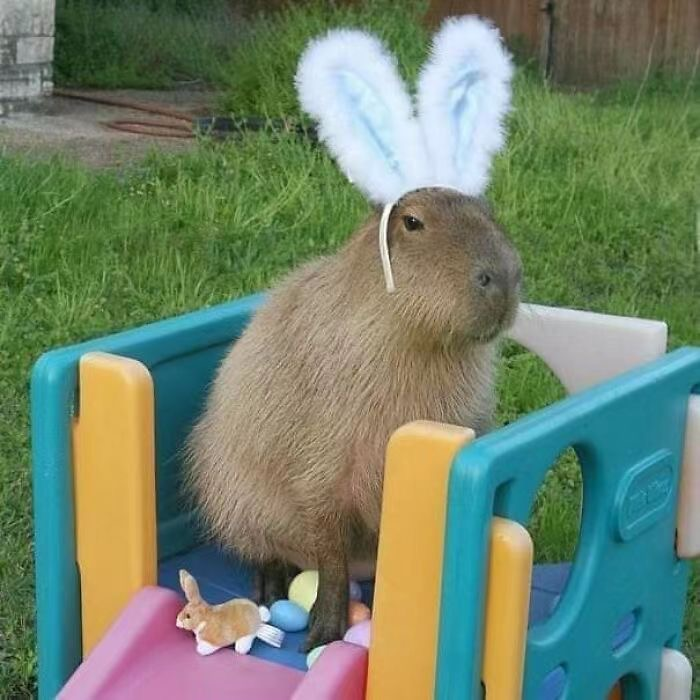

<h3>Tianhui (Valerie) Liu</h3>

Welcome to my personal website. My name is Tianhui (Valerie) Liu, an undergrad about to graduate from University of Waterloo CS. I'm interested in differential privacy, machine learning, natural language processing, and security. I created this website to share fun stuff or technical stuff I recently learned. 

This is the latest version of my: <a href="./blog/docs/Tianhui_Liu_Resume.pdf">Resume</a>.

Visit my [Github repository](https://github.com/valerie-lth).

People say I look like a capybara, so I shall be a capybara.

